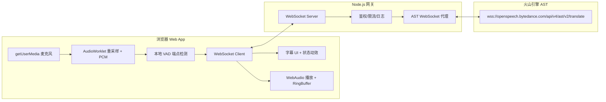
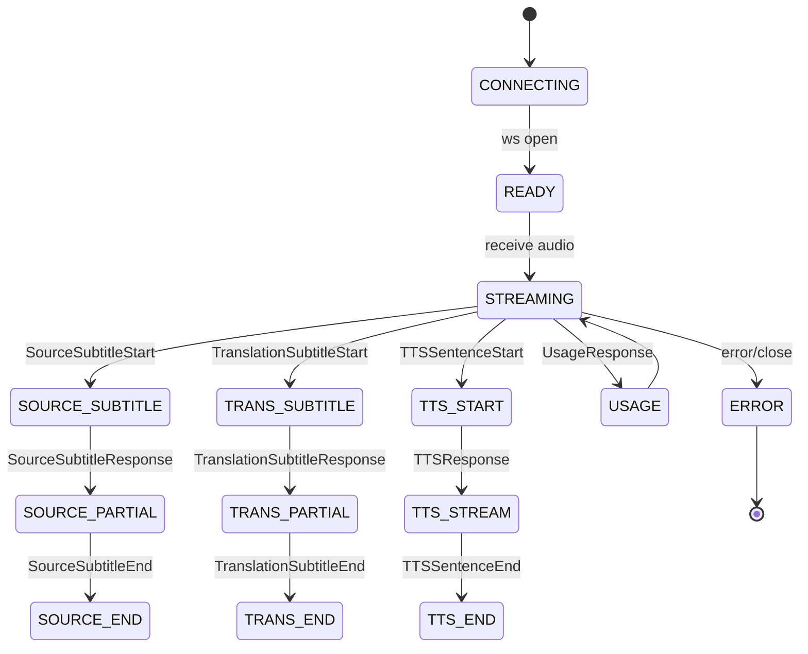

# 实时语音同传学习助手（Web App）方案

## 1. 系统总体架构图



## 2. 前端音频处理流程

1. **采集与重采样**：使用 `getUserMedia` 获取麦克风音频（默认 48kHz/Float32），通过 `AudioWorklet` 重采样至 16kHz，并转换为 16-bit PCM（单声道）。
2. **VAD 端点检测**：
   - 连续有声 ≥ 100ms 视为开始讲话（进入 `SPEAKING`）。
   - 连续静音 ≥ 650ms 视为一句话结束（进入 `ENDPOINT`）。
3. **流式发送**：将 PCM chunk（20ms 或 40ms 帧）通过 WebSocket 发送至 Node 网关。
4. **字幕与 TTS 处理**：
   - 原文字幕事件：实时更新“左侧”原文区。
   - 译文字幕事件：实时更新“右侧”译文区。
   - TTS 音频帧：写入 PCM RingBuffer，优先语音播报。
5. **插话（barge-in）**：检测到用户重新开口（≥100ms）时，立即淡出当前播放并清空未播完译文。

## 3. Node 后端 WebSocket 协议设计

### 3.1 前端 ⇄ Node

**连接**：`wss://<gateway>/ws`

**消息类型（JSON）**：

- `client.start`
  ```json
  {
    "type": "client.start",
    "requestId": "uuid",
    "direction": "AUTO|EN_ZH|ZH_EN",
    "vad": { "speechMs": 100, "silenceMs": 650 },
    "audio": { "sampleRate": 16000, "format": "pcm_s16le", "channels": 1 }
  }
  ```

- `client.audio`
  ```json
  {
    "type": "client.audio",
    "requestId": "uuid",
    "seq": 1024,
    "timestamp": 1730000000
  }
  ```
  > 音频二进制帧通过 WebSocket **binary** 发送，与 `client.audio` 的 JSON 头对应同一 `seq`。

- `client.end`
  ```json
  { "type": "client.end", "requestId": "uuid" }
  ```

**服务端响应（JSON + 二进制）**：

- `server.source_subtitle` / `server.translation_subtitle`
  ```json
  {
    "type": "server.translation_subtitle",
    "requestId": "uuid",
    "sentenceId": "s_12",
    "phase": "start|partial|end",
    "text": "你好，欢迎来到实时同传。"
  }
  ```

- `server.tts_start` / `server.tts_audio` / `server.tts_end`
  ```json
  { "type": "server.tts_start", "requestId": "uuid", "sentenceId": "s_12" }
  ```
  `server.tts_audio` 采用 **binary** PCM 帧；JSON header 携带 `sentenceId`/`seq`。

- `server.error`
  ```json
  { "type": "server.error", "requestId": "uuid", "code": "AST_4XX", "message": "..." }
  ```

### 3.2 Node ⇄ AST

- 连接时附加 Header：
  - `X-Api-App-Key`
  - `X-Api-Access-Key`
  - `X-Api-Resource-Id: volc.service_type.10053`
- 双向转发：
  - 前端音频帧 → AST WebSocket
  - AST 事件（字幕/TTS/Usage） → 前端

## 4. AST 事件处理状态机



## 5. VAD 参数推荐表

| 参数 | 推荐值 | 说明 | 备注 |
| --- | --- | --- | --- |
| `speechMs` | 100ms | 连续有声判定开始说话 | 灵敏度较高，利于 barge-in |
| `silenceMs` | 650ms | 连续静音判定句末 | 平衡延迟与准确率 |
| `energyThreshold` | -42dBFS | VAD 能量门限 | 播报期间可提高到 -38dBFS |
| `minChunkMs` | 20ms | 音频分帧 | 适配 AST 流式输入 |

## 6. 播放队列与缓冲策略

### 6.1 TTSUtterance 结构

```ts
interface TTSUtterance {
  id: string;
  text?: string;
  audioChunks: Int16Array[];
  bufferedMs: number;
  started: boolean;
  ended: boolean;
}
```

### 6.2 播放状态机

- **IDLE**：无任务，等待 `tts_start`。
- **BUFFERING**：缓冲首句 ≥ 250ms 后进入播放。
- **PLAYING**：RingBuffer 读取并播放。
- **DRAINING**：当前句播完，切换下句（若有）。
- **PAUSED_FOR_BARGEIN**：检测到插话，淡出并丢弃未播完句子。

### 6.3 插话策略

1. VAD 检测到用户重新开口 ≥ 100ms。
2. 播放端立刻淡出（50~80ms），清空当前句剩余音频。
3. 继续采集用户音频并发送到后端。

### 6.4 防回声建议

- `echoCancellation: true`、`noiseSuppression: true`。
- 播放期间降低上行增益（-10dB）。
- 提高 `energyThreshold`，避免播报被误判为用户语音。
